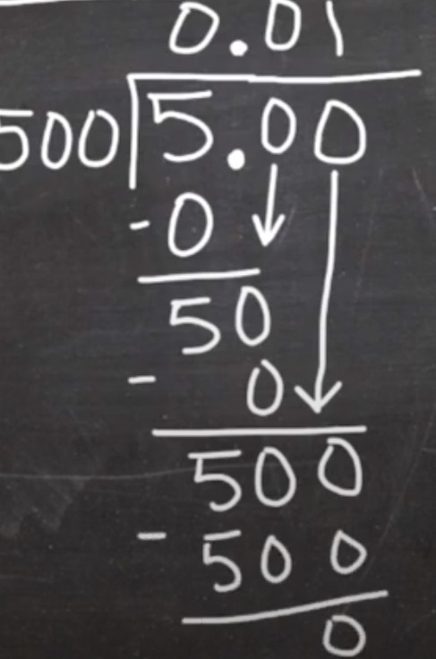

### least common multiple (LCM)
the smallest multiple that two or more numbers have in common

LCM of 8 and 12 is = 24  
Because multiple of **8** is 8, 16, **24**  
and multiple of **12** is 12, **24**

### greatest common divisor (GCD)
greatest common divisor (GCD) of two or more integers, which are not all zero, is the **largest positive integer that divides each of the integers**.  
GCD of 30 and 45 is 15  
GCD of 8 and 5 is 1  

we can also find LCM by using GCD
$$
lcm(a,b) = \frac{|a \cdot b|}{gcd(a,b)}
$$

### long division with divisor bigger than dividend
{max-height: 200px, display: block, margin: 0 auto}

5 divided by 500

### Dividing decimals
* Multiply the dividend and divisor by a power of ten that will make the divisor a whole number.
* Divide as though working with whole numbers.
>$$
\begin{align}
\frac{0.0054}{0.00108}
\end{align}
$$