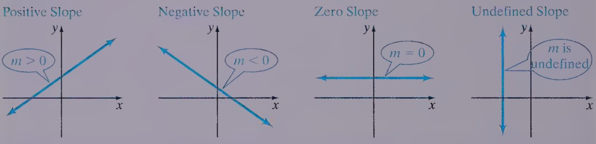

**Linear Equation** in two variables is an equation of the form

$$ 
\begin{align} 
&\ Ax+By = C 
\end{align}
$$

* $A, B,$ and $C$ are real numbers.
* $A$ and $B$ cannot both be 0.

When linear equation is written in $Ax+By = C$, its called **standard form**

>* $\frac{1}{2}x+\frac{2}{3}y=9$
>* $\frac{1}{3}y = x + 2$
>* $-2y = 5$

## Graphing Methods
* Plotting Points
  1. Find several ordered pairs that satisfy the equation.
  1. Plot the points found in Step 1 in a rectangular coordinate system.
  1. Connect the points with a smooth curve or line.
* Using Intercept
  1. Turn the equation into standard form (optional)
  1. To find the x-intercept(s), if any, of the graph of an equation, let y = 0 in the equation and solve for x.
  1. To find the y-intercept(s), if any, of the graph of an equation, let x = 0 in the equation and solve for y.

>“How many points do I need to find be¬
fore I can be sure that I have a complete graph?"

> it depends on the type of equation you are graphing. In mathematics, we classify equations as different types. For example, linear equation.

## Slope

 <i>"Rise over run"</i> 

If $x_{1} \neq x_{2}$, the **slope m** of the line containing the points $(x_{1}, x_{2})$ and $(y_{1}, y_{2})$ is defined by the formula

 

$m=\frac{y_{2}-y_{1}}{x_{2}-x_{1}} = \frac{\Delta y}{\Delta x}$ , $x_{1} \neq x_{2}$

{max-height: 150px, display: block, margin: 0 auto}

> It doesn't matter which point is called $(x_{1}, y_{1})$ and which is called $(x_{2}, y_{2})$. The answer will be the same.

### Slope-Intercept Form
$y = mx + b$  
* $m$ is the slope
* $b$ is y-intercept

> Any linear equation, except equation with form $x = a$ (Vertical Line) can be written in slope-intercept form

### Point-Slope Form
$m(x-x_{1})=y-y_{1}$

### TIPS
* If the **slope** and **y-intercept** are known, use the **slope-intercept** form
* If the **slope** and **a point** which is **not the y-intercept** are known, use the **point-slope form**
* If **two points** are known, first find the **slope**, then use that slope and one of the points in the **point-slope formula**

